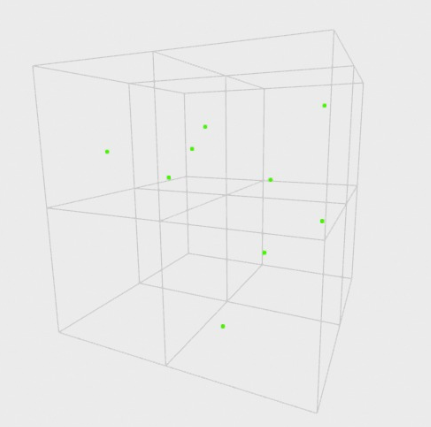

# Documentación del Proyecto Octree - Algortimos y Estructura de datos - UTEC
## Profesor
- Brenner Humberto Ojeda

## Descripción General
Este proyecto pretende dar una introducción a las capacidades del árbol octal a partir de una implementación rigurosa pero básica, pues no soporta el uso genérico. Además, se hará uso de la librería Open3D para poder visualizar la estructura de datos y por último una breve documentación de los métodos de la clase OctreeNode.

## Instalación de Open3D

### MacOS
- 1) Instalar Open3D (Homebrew)
brew install open3d          # necesita Homebrew ≥ 3.0

- 2) Clonar el proyecto
git clone https://github.com/USER/octree-demo.git
cd octree-demo

- 3) Construir
cmake -B build -DOpen3D_ROOT=$(brew --prefix open3d)
cmake --build build -j
./build/octree                # ← ejecutable

### Linux/GNU
- 1) Descargar y extraer Open3D (C++)
wget https://github.com/isl-org/Open3D/releases/download/v0.19.0/open3d-linux-x86_64-0.19.0.tar.xz
mkdir -p $HOME/opt && tar -xf open3d-linux-x86_64-0.19.0.tar.xz -C $HOME/opt
export Open3D_ROOT=$HOME/opt/Open3D

- 2) Clonar y compilar tu proyecto
git clone https://github.com/USER/octree.git
cd octree
cmake -B build -DOpen3D_ROOT=$Open3D_ROOT
cmake --build build -j$(nproc)
./build/octree

### Windows
- 1) Descargar paquete Release pre-compilado
Invoke-WebRequest -Uri https://github.com/isl-org/Open3D/releases/download/v0.19.0/open3d-windows-x86_64-msvc-Release-0.19.0.zip -OutFile open3d.zip
Expand-Archive open3d.zip C:\libs\Open3D

- 2) Clonar tu proyecto
git clone https://github.com/USER/octree-demo.git
cd octree-demo

- 3) Generar solución y compilar (modo Release)
cmake -B build -A x64 -DOpen3D_ROOT=C:\libs\Open3D
cmake --build build --config Release

- 4) Ejecutar
.\build\Release\octree.exe

## Implementación

  

Creamos 3 clases: OctreeNode, Octree y Point3D.

La clase OctreeNode es el que contiene la funcionalidad de la estructura. La clase Octree se podría entender como un wrapper, pues sus métodos solo llaman a los metodos del root. Por lo tanto, la documentación es sobre el Point3D y los métodos de OctreeNode.

## Point3D

**Propósito:** Representa un punto en el espacio tridimensional.

**Atributos:**
- x, y, z: Coordenadas del punto (tipo double).

**Métodos:**
- Construcción por defecto y parametrizado.
- Sobrecarga del operador "==" para comparar 2 puntos.

## OctreeNode

**Propósito:** Representa un nodo del octree que puede almacenar puntos o subdividirse en 8 subnodos (octante).

**Atributos:**
- center: Centro del cubo que representa el nodo.
- sideLength: Longitud del lado del cubo.
- minSideLength: Longitud mínima permitida para subdividir.
- points: Vector de puntos que están contenidos en este nodo.
- children[8]: Punteros a los 8 subnodos (octantes).

**Métodos:**

### Contains

**Propósito:**
Determina si un punto __p__ se encuentra dentro del cubo representado por el nodo actual.

**Cómo funciona:**
El nodo es un cubo centrado en __center__ con longitud __sideLength__. Se calcula la mitad (__half__) y se verifica si __p.x__, __p.y__ y __p.z__ están dentro del rango __[center - half, center + half]__.

**Importancia:**
Solo los puntos que están __dentro del cubo del nodo__ pueden ser insertados o eliminados. Es una verificación espacial fundamental.

### CollectAllPoints

**Propósito:**
Recoge todos los puntos contenidos en este nodo y en todos sus descendientes.

**Cómo funciona:**
1. Añade los puntos locales al __collector__.
2. Llama recursivamente a __collectAllPoints__ en cada hijo.

**Importancia:**
Útil para __recolectar información completa__ del árbol, por ejemplo, durante una fusión (merge) o para exportar el contenido.

### Search

**Propósito:**
Determina si un punto específico __p__ está contenido dentro del octree, comenzando desde el nodo actual.

**Como funciona:**
1. Verificación de contención espacial (contains)
  - Se verifica si el punto está dentro del volumen espacial (AABB) del nodo actual.
  - Si no está dentro, se retorna __false__ de inmediato (evita búsquedas innecesarias).
2. Búsqueda local en el nodo actual
  - Se recorren los puntos almacenados directamente en el nodo.
  - Si el punto coincide con alguno de ellos (__q == p__), se retorna __true__.
3. Descenso al hijo adecuado
  - Si el nodo tiene hijos (__children[0]__ no es __nullptr__), se calcula en qué hijo debería estar el punto.
  - Para ello, se utiliza una codificación binaria:
    - __x > center.x__ → bit 2
    - __y > center.y__ → bit 1
    - __z > center.z__ → bit 0
  (Esto da un índice entre 0 y 7 (porque 2^3 = 8) que selecciona el hijo correcto).
  - Se invoca recursivamente __searchPoint(p)__ en ese hijo.
4. Retorno final
  - Si no se encontró el punto ni localmente ni en los hijos, se retorna false.

**Importancia:**
Si no se encontró el punto ni localmente ni en los hijos, se retorna __false__.

### Insert

**Propósito:**
Inserta un punto en el árbol comenzando desde este nodo.

**Como funciona:**
1. Verifica si el punto está dentro del nodo actual usando __contains__.
2. Si el número de puntos almacenados es menor al máximo permitido (__MAX_POINTS__) o si el nodo no puede subdividirse más (por límite de tamaño), se guarda el punto localmente.
3. Si ya hay demasiados puntos y el nodo aún puede subdividirse:
    - Se llama al método __subdivide()__ si aún no hay hijos.
    - Intenta insertar el punto en uno de los 8 hijos.
4. Si por alguna razón no se pudo insertar en los hijos, se guarda localmente como último recurso.

**Importancia:**
Controla la __distribución espacial de los datos__ y mantiene la eficiencia del octree mediante subdivisiones progresivas.

###  Subdivide

**Propósito:**
Divide el nodo actual en 8 subnodos (octantes) y distribuye sus puntos entre ellos.

**Cómo funciona:**
1. Calcula los nuevos centros de los 8 subcubes (sumando/subtrayendo __quarter__ en x, y, z).

2. Crea un nuevo nodo __OctreeNode__ para cada subcubículo y lo almacena en __children[]__.

3. Mueve los puntos existentes a los hijos si es posible. Si algún punto no puede insertarse, lo guarda de nuevo en el nodo actual como "fallback".

**Importancia:**
Permite que el árbol crezca en profundidad y __mantenga pocos puntos por nodo__, asegurando eficiencia en búsquedas e inserciones.

### Remove

**Propósito:**
Elimina un punto del nodo o de alguno de sus hijos.

**Como funciona:**
1. Comprueba si el punto está en el cubo del nodo (__contains__).
2. Si el punto está __almacenado localmente__, lo elimina del vector __points__.
3. Si el nodo tiene hijos:
    - Intenta eliminarlo en los hijos recursivamente.
    - Si el total de puntos en todos los hijos es menor a __MAX_POINTS__, llama a __merge()__ para fusionar los hijos en este nodo.

**Importancia:**
Permite mantener el árbol limpio, y además garantiza que no queden subdivisiones innecesarias si el número de puntos baja.

### Merge

**Propósito:**
Elimina los subnodos y traslada todos sus puntos al nodo actual.

**Como funciona:**:
1. Recolecta los puntos de todos los hijos usando __collectAllPoints__.
2. Libera la memoria de los hijos (__delete__).
3. Inserta los puntos en el vector __points__ local.

**Importancia:**
Permite __reducir la complejidad del árbol__ cuando la cantidad de datos ha disminuido, manteniendo un árbol compacto y eficiente.

### Update

**Propósito:**
Actualiza un punto existente (__from__) con una nueva ubicación (__destiny__), simulando un "movimiento" del punto.

**Como funciona:**

1. Eliminar el punto original:
Se intenta eliminar el punto __from__ del árbol. Si falla (no existe o fuera del nodo), retorna __false__.

2. Insertar el nuevo punto:
Se intenta insertar el punto __destiny__. Si falla (por ejemplo, fuera del dominio del octree), se revierte la operación insertando de nuevo el punto __from__.

3. Retorno final:
Si la inserción fue exitosa, retorna __true__; si se tuvo que revertir, retorna __false__.

**Importancia:**
Proporciona una forma segura de "mover" un punto dentro del octree. Su implementación protege contra pérdida de datos en caso de fallo en la nueva inserción, actuando como una transacción atómica (todo o nada).

### GetNearby

**Propósito:**
Recoge todos los puntos en el árbol que están dentro de una cierta distancia euclidiana desde una posición dada.

**Como funciona:**
1. Calcula la __distancia mínima__ entre la posición y el cubo actual.
2. Si la distancia mínima excede __maxDistance__, __termina la búsqueda en este nodo__.
3. Compara cada punto localmente almacenado, y si su distancia al punto dado es menor a __maxDistance__, lo agrega a __results__.
4. Si hay hijos, los explora recursivamente.

**Importancia:**
Clave para __búsquedas espaciales eficientes__ de vecinos cercanos.

